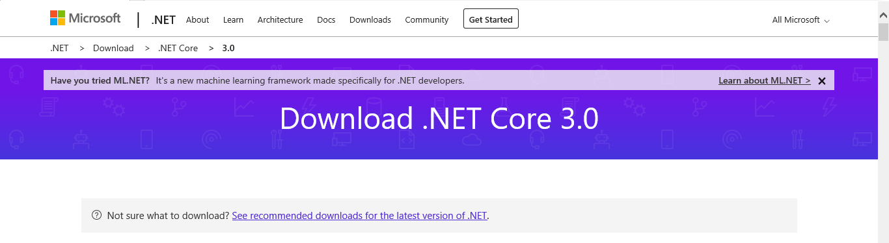

# Ejercicio de Markdown

## Instalacion de dotnet core 3.0
Lo primero que tenemos que hacer
es Descargar el paquete de instalacion de dotnet 3.0 del siguiente
[lugar](https://dotnet.microsoft.com/download/dotnet-core/3.0).
Es importante descargar el SDK, porque **Vamos a Programar**

La pagina se ve asi:

## Instalacion y configuracion de Visual Studio Code para C#

## Instalacion de git. conectado a tu cuenta de GitHub y VSC
